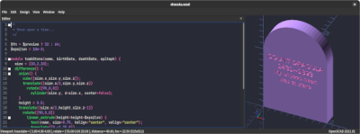
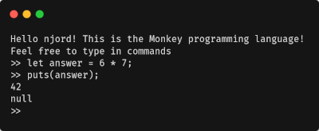
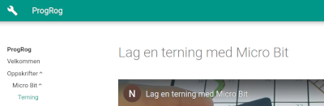

[Dracula](https://draculatheme.com/) is my favorite color theme and I use it for most of my applications. However, two applications I use frequently were missing themes. Therefore I created, submitted and maintain the theme for [GtkSourceView](https://draculatheme.com/gtksourceview) and [OpenSCAD](https://draculatheme.com/openscad).

---

[Social Insecurity](https://github.com/solbero/social-insecurity) is a web application I maintain for the course [Information and Software Security](https://www.uis.no/en/course/DAT250_1) at the University of Stavanger. The application contains numerous security vulnerabilities, and the students are tasked with finding and fixing them.

---

[Ignoro](https://github.com/solbero/ignoro) is a CLI application I designed to help me and others quickly create and modify .gitignore files for our software projects. This was the first project where I used [Typer](https://typer.tiangolo.com/) for creating the CLI in Python.

---

[Tempconv](https://github.com/solbero/tempconv) is a temperature conversion tool I created to help me learn the basics of Go. The goal of the project was to create a non-trivial CLI application using only Go‘s standard library. Tempconv ended up being able to convert between eight different temperature scales with a precision of 12 decimal places.

---

[Monkey](https://github.com/solbero/monkey) is my implementation of the interpreter described in _[Writing an Interpreter in Go](https://interpreterbook.com/)_. This book is a great introduction to writing interpreters, and I highly recommend it to anyone who is interested in learning more about the subject.

---

[Hexpex](https://github.com/solbero/hexpex) is a type-hinted, object-oriented library I created for working with hexagonal grids in Python. The plan was to use this library in [one of my other projects](https://github.com/solbero/ti4-mapmaker-api), but unfortunately that project stalled. Hexpex was also the first project I published to [PyPI](https://pypi.org/).

---

[Lutris Kodi Addon](https://github.com/RobLoach/lutris-kodi-addon) was the first open source project I made a large contribution to. It is an addon for the [Kodi media center](https://kodi.tv/) that allows you to launch games using the [Lutris](https://lutris.net/) game launcher. Because of my contributions to the project, I became the _de facto_ maintainer of the addon in 2019.

---

[ProgRog](https://solbero.github.io/progrog/) is a learning resource I created while I was working full-time as a teacher. The goal was to create a resource that would help my students learn the basics of programming using a [BBC micro:bit](https://microbit.org/).
